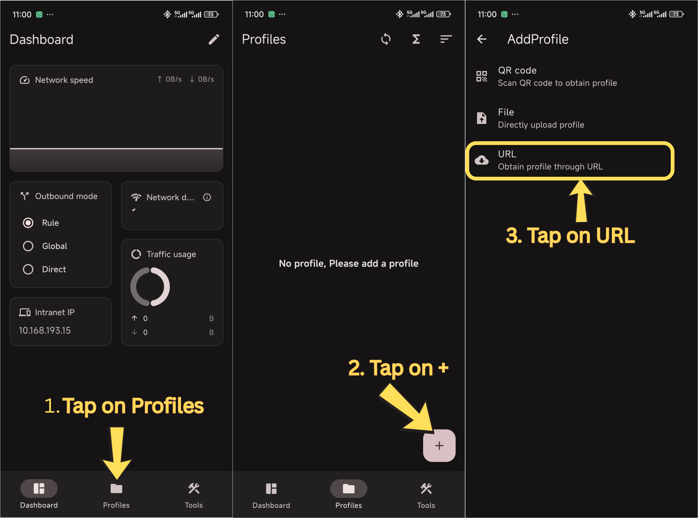
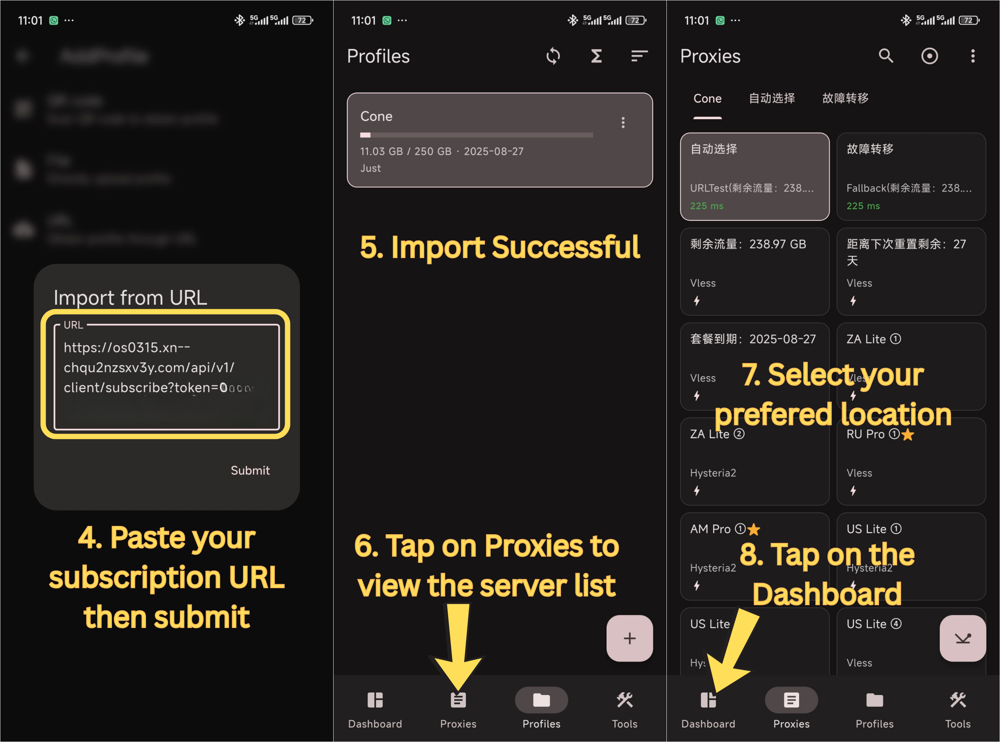
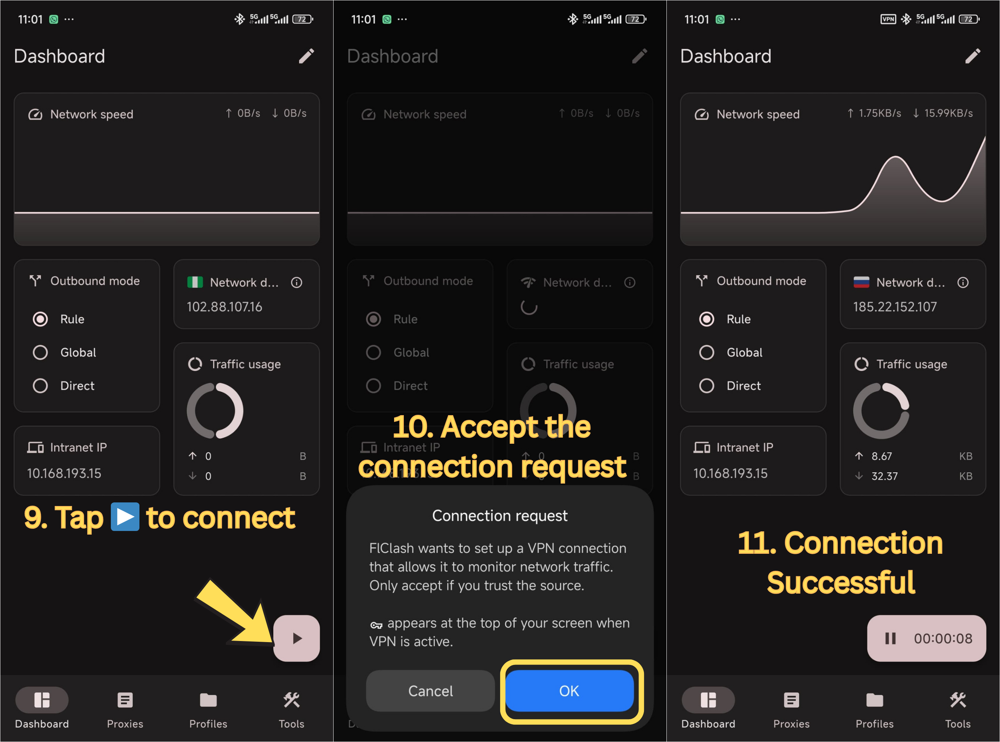
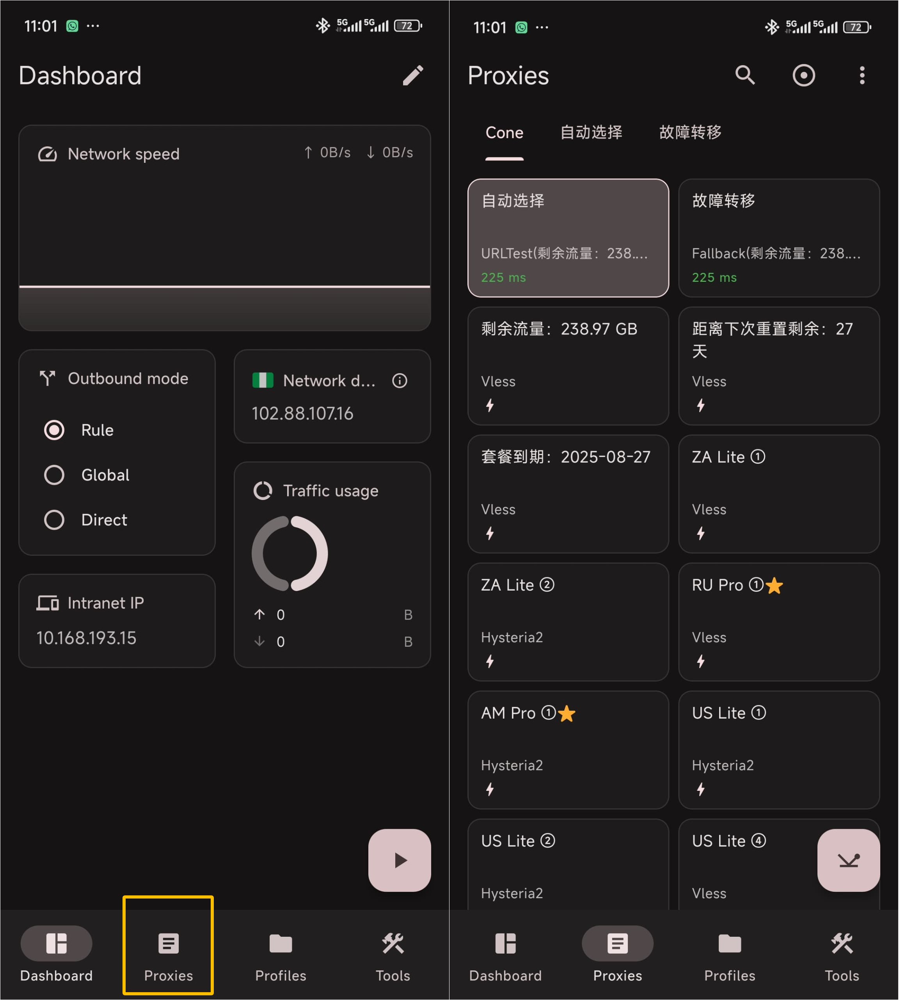

# FLClash for Android


If you have trouble setting up, Please contact customer care on Telegram [Click me to connect to Customer care Telegram](https://t.me/conesupport)


## Step 1. Download and Installation

> Github download is typically slow or inaccesible from mainland china,please use alternative links below

1. Download and install the FLClash app on your Android device using the link(s) below.

[**Download Link 1**](https://www.mediafire.com/file/bmrtdu4wv7rwmrq/flclash_0.8.87.apk/file)

[**Alternate Download Link**](https://www.mediafire.com/file/bmrtdu4wv7rwmrq/flclash_0.8.87.apk/file)


**NOTE: Please use the alternate download link if Download Link 1 does not work**


***

## Step 2. Import Subscription Link

### Manual import

1. [Click me to login your account dashboard ](https://dash.coneapp.top)
2. Scroll to the _Quick Import_ section _and &#x74;_&#x61;p on _Copy_ to copy your subscription URL

<figure><figcaption>
Copy Subscription Link
</figcaption></figure>

3. Open the FLClash app, tap on _Profiles_  >  ➕  >  **URL** Obtain profile through URL

<figure><figcaption></figcaption></figure>

4. Paste your subscription URL.
5. After Import successful, tap on **Proxies** to select a location.
6. After selecting a location, tap on Dashboard

<figure><figcaption></figcaption></figure>

7. Tap on ▶️>  Accept the Connection request (Depends on your device) &#x20;

<figure><figcaption></figcaption></figure>

## Step 3. Selecting Servers

1. Tap on Proxies
2. Pick your prefered location

<figure><figcaption>
Change Servers
</figcaption></figure>


Note;

Recommended to keep default mode (**Rule Mode**)&#x20;

**Global Mode:** Regardless of domestic and foreign websites, all use this software to speed up access. _**Disadvantages**_: Domestic websites will become very slow or inaccessible.


