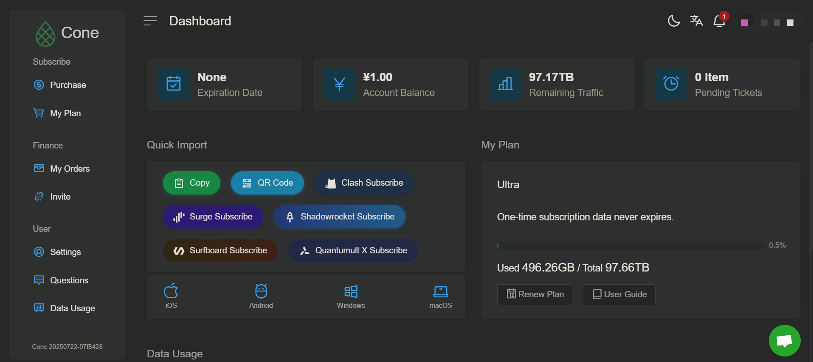
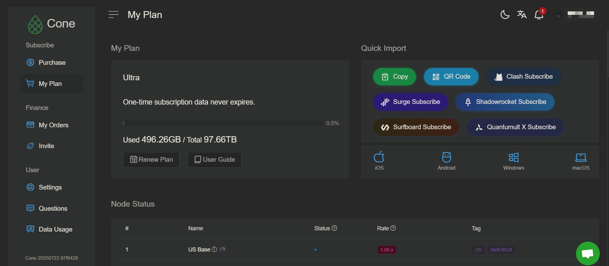
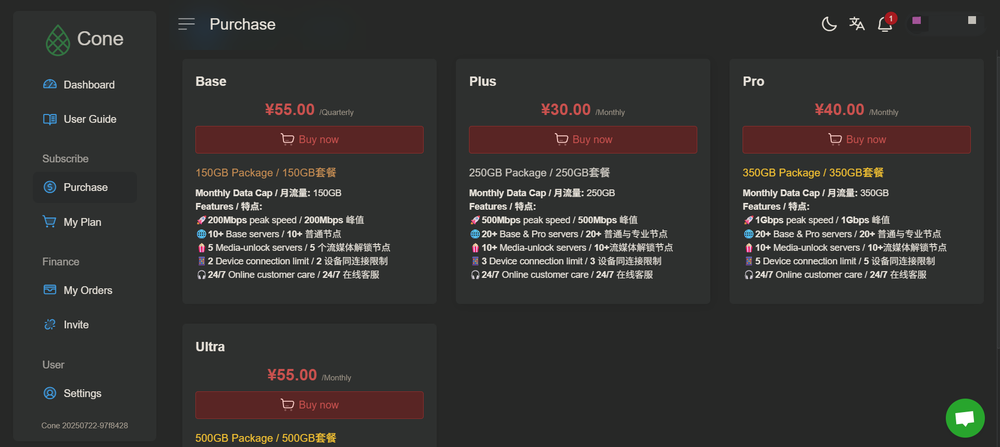
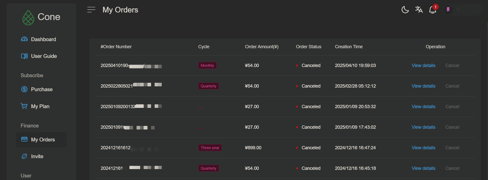

# Account & Billing

### **1. Dashboard Overview**

When you log in, you’ll see your main dashboard:

<figure><figcaption></figcaption></figure>

***

### **2. Subscriptions**

#### 📅 My Plan

Here you can check your **current plan** and renewal date.

<figure><figcaption></figcaption></figure>

#### 💳 Purchase

Choose a new plan or extend your subscription.

<figure><figcaption></figcaption></figure>

***

### **3. Finance & Orders**

#### 💰 My Orders

See your **purchase history**, download invoices, and track payments.

<figure><figcaption></figcaption></figure>

***

### **4. Invite Friends**

Invite friends to Cone and earn commission rewards.

#### 📊 Overview

**You can view the following information**

* Number of invited registrations
* Commission Ratio
* Commission pending confirmation
* Accumulated Commission
* Current Remaining Commission

#### 🎟 Invite Code Management

* Create / Delete Invite codes
* View Invite code creation Time

#### 💵 Commission Payment Record

* View commission payment records

<figure><figcaption></figcaption></figure>

***

### **5. Account Settings**

Under **User → Settings**, you can:

* Change your email
* Reset your password
* Update account preferences

<figure><figcaption></figcaption></figure>

***

### **6. Data Usage**

Monitor your bandwidth usage upto 30 days

<figure><figcaption></figcaption></figure>

***

### **7. Troubleshooting & Support**

Under **Questions**, you can:

* Browse FAQs
* Contact support
* Submit a ticket

<figure><figcaption></figcaption></figure>

### 👉 Still stuck? <mark style="background-color:$info;">**Contact Support**</mark>
