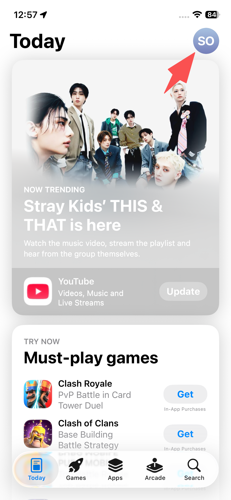
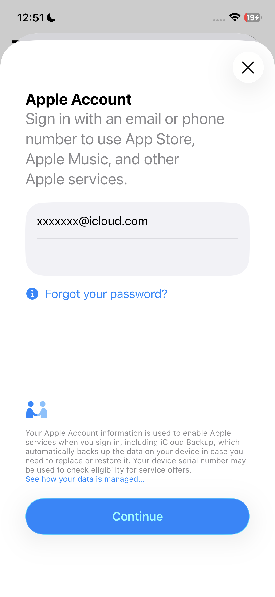

# Guide: Switch Apple account



### Sign out of your current account

* Open the App Store on your iOS device
* Tap on the profile icon

<figure><figcaption></figcaption></figure>

* Open your apple account
* Scroll down and sign out

<figure><figcaption></figcaption></figure>



### Sign into the alternate apple account

* Tap on Apple Account Sign in
* Choose "Not xxxx xxxx"

<figure><figcaption></figcaption></figure>

* Input the email and password
* Then tap on **Continue**

 

* Select other options
* Do not upgrade

<figure><figcaption></figcaption></figure>


✅ You should be signed in successfully.



Once the app has been installed successfully, you can switch back to your personal Apple ID normally.




***

### Frequently Asked Questions

#### 🔐 Is It Safe to Use Our Apple ID?

> ✅ **Yes — 100% safe.**\
> You are **only signing into the App Store**, not your whole iPhone.

* Your contacts, photos, and messages **will not be affected**
* Your iCloud or device settings **stay untouched**
* After download, it will **automatically switch back** to your original Apple ID
* You can still log back into your own Apple ID any time

**💡 You're only using our Apple ID temporarily to download Shadowrocket. That’s it.**
