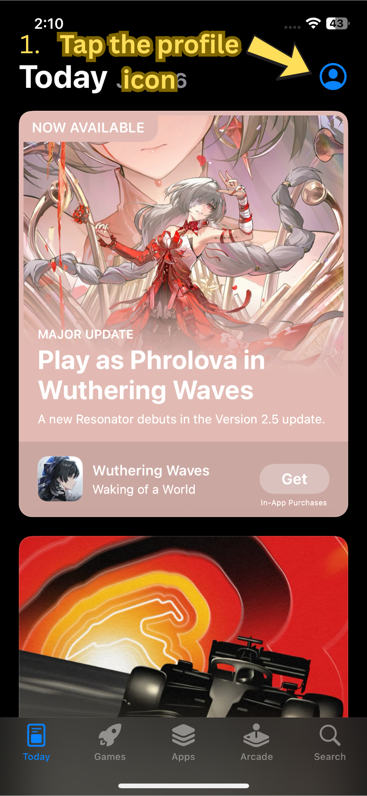

# Copy of Shadowrocket Install


**Shadowrocket costs $2.99 and is not available on Chinese-mainland Apple accounts**



#### **You can purchase the Shadowrocket app using your Apple ID (US, HK etc)**

👉 [**Buy Shadowrocket on App Store ($2.99)**](https://apps.apple.com/us/app/shadowrocket/id932747118)



<h3 align="center">If you have Chinese-mainland Apple account.</h3>

### Please follow the steps below to download the app using our Apple account


***

## 🔐 Step 1: Get Our Apple ID Login

### 👉 [**Click here to get our Apple account** ](https://app.alekwu.top/soft/shrkios.html)

***

## 👣 Step 2:  Sign into the App Store

<figure><figcaption></figcaption></figure>

<figure><figcaption></figcaption></figure>


**DO NOT Add your phone number during sign in**


<figure><figcaption></figcaption></figure>

***

## 🔍 Step 3: Search for “Shadowrocket” & Download It

Search “Shadowrocket” on the app store and download.

<figure><figcaption></figcaption></figure>

## 👉 **After successful installation,** [**Click here to proceed to Shadwrocket Setup**](https://help.coneapp.top/ios-iphone-and-ipad-setup-guide/recommended-shadowrocket-for-ios/shadowrocket-setup)


[shadowrocket-setup.md](shadowrocket-setup.md)


***

### Frequently Asked Questions

#### 🔐 Is It Safe to Use Our Apple ID?

> ✅ **Yes — 100% safe.**\
> You are **only signing into the App Store**, not your whole iPhone.

* Your contacts, photos, and messages **will not be affected**
* Your iCloud or device settings **stay untouched**
* After download, it will **automatically switch back** to your original Apple ID
* You can still log back into your own Apple ID any time

**💡 You're only using our Apple ID temporarily to download Shadowrocket. That’s it.**
