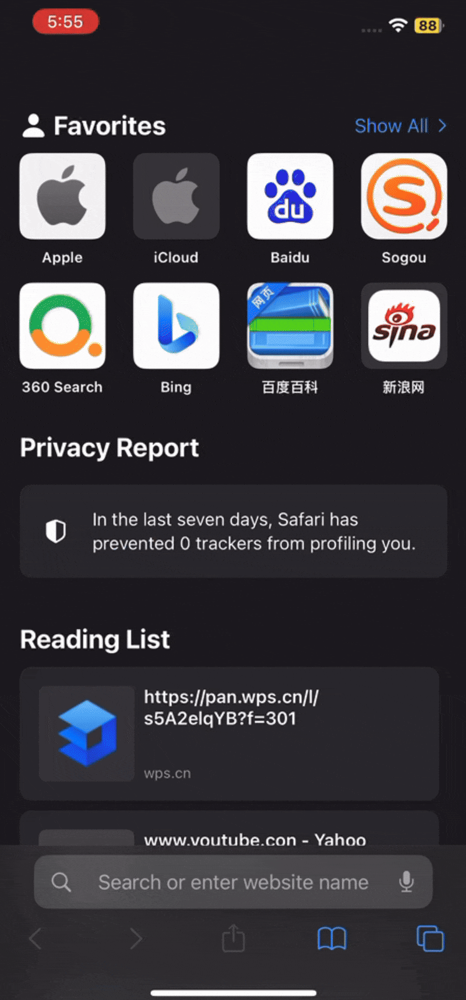
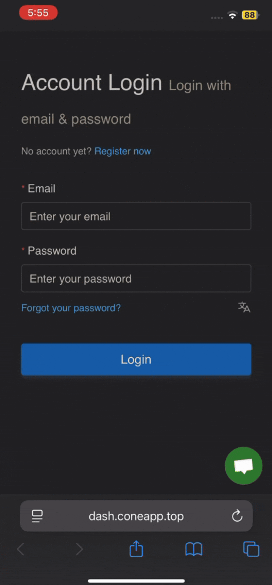
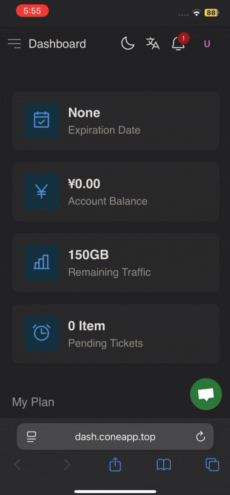

# ⚙️ Shadowrocket Setup

### 📢 READ THIS FIRST

✅ This guide starts **AFTER** you have already installed Shadowrocket.\
❌ If you don’t have the app yet:\
👉 [**Go here to download & install it first**](shadowrocket-install.md)

***



### Step 1: Login to your Cone account

**On your iPhone/iPad📱, open&#x20;**<mark style="color:purple;">**Safari**</mark>**&#x20;browser or&#x20;**<mark style="color:yellow;">**Google Chrome**</mark>

<figure><figcaption></figcaption></figure>

**Navigate to this website🌐:** [**https://dash.coneapp.top**](https://dash.coneapp.top/)

<figure><figcaption></figcaption></figure>

**Sign-up/Log in using your 📧Email &🔒Password**

<figure><figcaption></figcaption></figure>

**Scroll down⬇️ to Quick Import, tap&#x20;**<mark style="color:blue;">**Shadowrocket Subscribe**</mark>**, then tap on&#x20;**<mark style="color:$success;">**Open**</mark>

<figure><figcaption></figcaption></figure>

**After the&#x20;**<mark style="color:$success;">**Success**</mark>**&#x20;prompt, tap on the button to connect**

<figure><figcaption></figcaption></figure>

* **Install VPN Profile 🆗**
* **Allow "Shadowrocket" to Add VPN Configurations**
* **Input your password when it asks**

<figure><figcaption></figcaption></figure>

**✅ You’re now connected — enjoy unrestricted browsing.**

<figure><figcaption></figcaption></figure>




💡 **If One-Click setup doesn’t work** → Use **Manual Setup** below.


***

