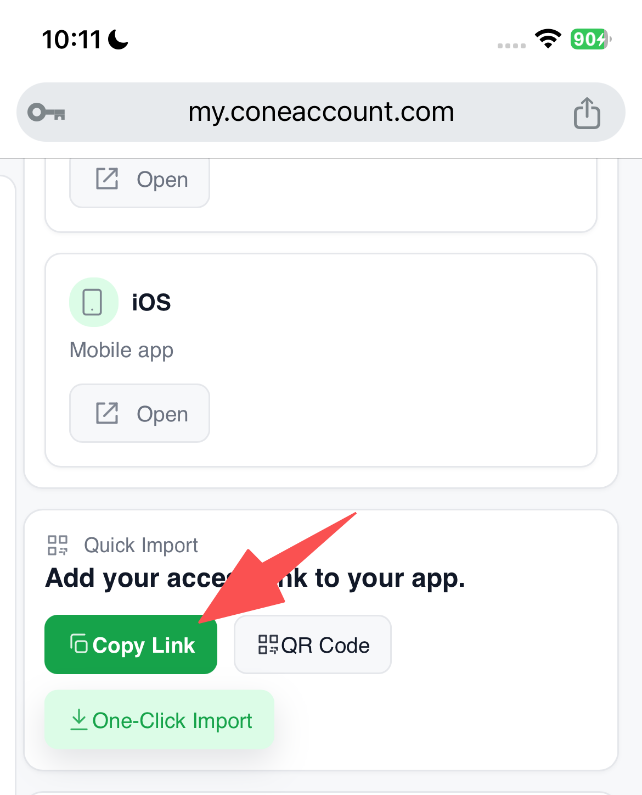
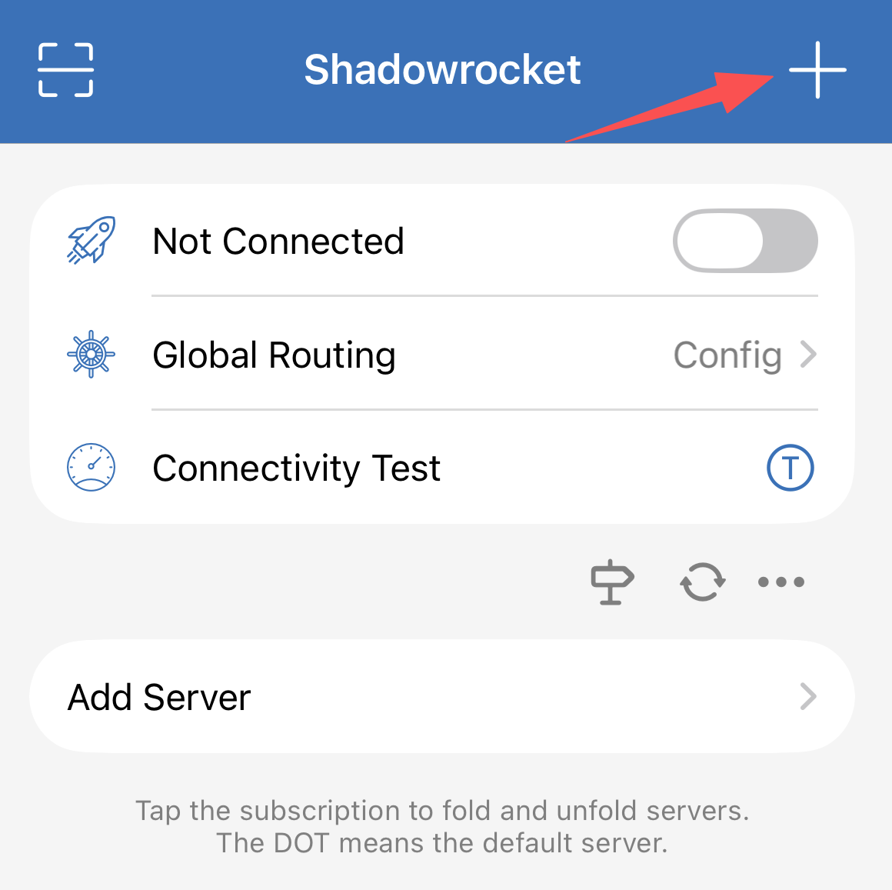

# Shadowrocket Setup


### Note

Shadowrocket is a paid app on the App Store. Please purchase it yourself

If you cannot find it, you need to switch to another App Store region.




## Step 1 — Install Shadowrocket

<table data-view="cards"><thead><tr><th align="center"></th></tr></thead><tbody><tr><td align="center">👉<a href="https://apps.apple.com/us/app/shadowrocket/id932747118"><strong>Download Shadworcket</strong></a></td></tr></tbody></table>


[guide-switch-apple-account.md](../guide-switch-apple-account.md)


Once Shadowrocket has been installed successfully, open the app to continue.


✅ You should now see the Shadowrocket home screen.




## Step 2 — Copy Your Cone Subscription Link

[Click here Log in](https://my.coneaccount.com/) to your Cone dashboard and copy your subscription link.

The link usually starts with:

```
https://
```

<figure><figcaption></figcaption></figure>


Make sure you copy the entire link.




## Step 3 — Add Your Subscription to Shadowrocket

1. Open Shadowrocket
2. Tap the **+** button in the top-right corner
3. Select **Subscribe**
4. In the URL field, paste your Cone subscription link
5. Tap **Save**

<figure><figcaption></figcaption></figure>

<figure><figcaption></figcaption></figure>


✅ You should now see one or more servers listed in the app.




## Step 4 — Connect

1. Tap the switch at the top right of the app to turn it ON

When your iPhone shows:

> “Shadowrocket Would Like to Add VPN Configurations”

Tap: **Allow**

You may also be asked for:

* Face ID
* Touch ID
* Passcode

This is normal.

<figure><figcaption></figcaption></figure>


Without this permission, the VPN cannot connect.


The first time connecting may take a few seconds.

✅ When connected:

* The switch will turn ON
* A VPN icon will appear on your iPhone status bar

Your VPN is now working.



## Step 6 — Test Your Connection

Open:

* YouTube
* Google
* ChatGPT
* Netflix
* Instagram

If websites and apps load normally, setup is complete.




💡 **If One-Click setup doesn’t work** → Use **Manual Setup** below.


<details>

<summary>Common Questions</summary>


### “Connected” But Websites Don’t Open

Usually this means the current server is temporarily unavailable.

Try another server.

***

### The VPN Switch Turns Off Automatically

This usually happens because:

* VPN permission was not allowed
* Another VPN app is installed
* iPhone network temporarily failed

Try restarting your iPhone and reconnecting.

***

### Shadowrocket Says “Timeout”

Usually caused by:

* Poor internet connection
* Network restrictions
* Current server issue

Try:

* Switching Wi-Fi/mobile data
* Changing servers
* Updating subscription

</details>

***

<details>

<summary>If It Doesn’t Connect</summary>

Try these steps:

### Fix 1 — Turn VPN Off and On

1. Turn the VPN OFF
2. Wait 5 seconds
3. Turn it ON again

***

### Fix 2 — Change Server

1. Open Shadowrocket
2. Select a different server from the list
3. Try connecting again

***

### Fix 3 — Update Your Subscription

1. Tap and hold your subscription
2. Tap **Update**

Then try connecting again.

</details>

***


