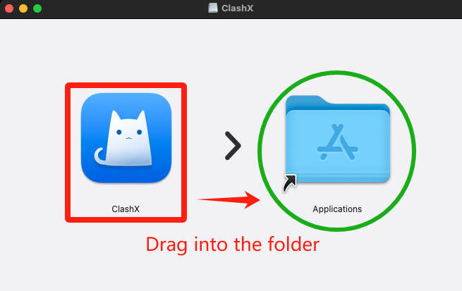
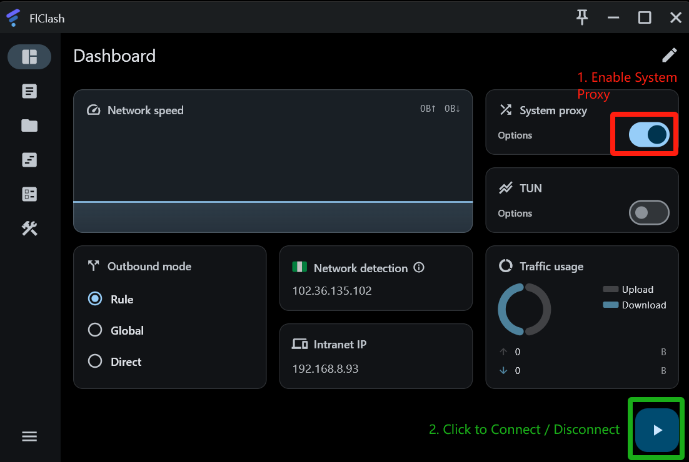

# FlClash for Mac


If you have trouble setting up, Please contact customer care on Telegram [Click me to connect to Customer care Telegram](https://t.me/conesupport)


***

### **🚀 Step 1: Get FlClash on Your PC**

Download the FlClash app on your Mac computer using the link(s) below;

**M1/M2 Mac**

[**Download Link 1**](https://appdl.coneapp.top/soft/mac/flclash/arm/new/FlClash-macos-arm64.dmg)

[**Alternate Download Link**](https://www.mediafire.com/file/9j1a19q0wf2aoud/FlClash-0.8.89-macos-arm64.dmg/file)

***

**Intel Mac**

[**Download Link 1**](https://appdl.coneapp.top/soft/mac/flclash/intel/new/FlClash-macos-x64.dmg)

[**Alternate Download Link**](https://www.mediafire.com/file/ue2n0dk1gta4r48/FlClash-0.8.89-macos-amd64.dmg/file)

***

### Installation


To run the FlClash app on your Mac, you'll need to allow third-party apps in your settings.&#x20;

[How to open Mac app from an unidentified developer](https://www.macworld.com/article/672947/how-to-open-a-mac-app-from-an-unidentified-developer.html)


1. Double click the downloaded FlClas&#x68;_.dmg_ file (We will use ClashX as an example)

<figure><figcaption></figcaption></figure>

2. Follow the prompt to drag the app to your Applications Folder

<figure><figcaption></figcaption></figure>

3. After copying, close the window, Open the applications folder and run the ClashX, an app security prompt should show up

<figure><figcaption></figcaption></figure>

4. Head to **System Settings > Privacy & Security,** Click on the _Open Anyways_ option under the secuity notification

<figure><figcaption></figcaption></figure>

### **🌍 Step 2: Add the Servers**

1. [**Login to your account dashboard**](https://dash.coneapp.top/) **(Sign in with your registered email and password)**
2. Scroll to the Quick Import section and tap on Copy

<figure><figcaption></figcaption></figure>

### Paste the API&#x20;

1. Tap on the 📁 icon, then tap on the ➕ sign at the bottom right
2. Select **URL**  (Obtain profile through URL)
3. Paste your subscription URL in the "URL" box and click "Submit."

<figure><figcaption></figcaption></figure>

4. Your server list has now been downloaded to the app.

***

## Step 4: Connect

### Select a server and mode

1. Tap on the 📄 icon to access the server list
2. Select a server from the list

<figure><figcaption></figcaption></figure>

### Connect

1. Go to the "General" tab
2. Toggle the "System Proxy" switch
3. Tap on the ▶️ icon to connect/disconnect

<figure><figcaption></figcaption></figure>


Modes:

Global: All connections go through the app

Rule: Websites go to different servers based on pre-configured rule sets.



Make sure to **turn the "System Proxy" switch OFF before quitting the app,** or you won't have any internet if you do so (i.e., a kill switch).

To fix it, restart the app and turn the "System Proxy" switch OFF, and then quit the app.


## Additional Steps \[IMPORTANT]

### Enable TUN/TAP

If you want to play games with Clash or have all apps go through Clash, you need to enable TUN/TAP Mode.

1. Go to the "General" tab
2. Click "Manage" next to "TAP Device."
3. Click "Install"

Now reconnect.

### Windows Store apps

Windows Store apps do not go through the VPN by default, even when TAP is enabled. You need to force them by using the UWP Loopback Helper.

1. Go to the "Settings" tab
2. Click on "Loopback unlock tool"
3. If there's a popup, click "No."
4. Select all the apps you want to force through the VPN
5. Click "Save Changes."

### Enable Start with Windows

If you want Clash to automatically start when you boot your computer, you need to enable this option.

1. Go to the "Settings" tab
2. Tap on Application
3. Toggle the "Auto Launch" switch

***

