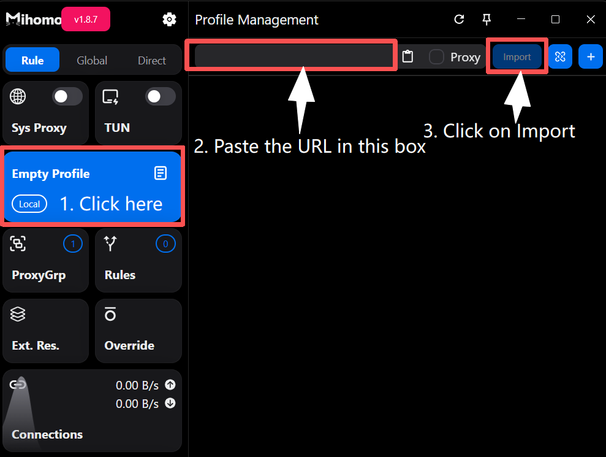

# Mihomo Party for Windows


If you have trouble setting up, Please contact customer care on Telegram [Click me to connect to Customer care Telegram](https://t.me/conesupport)


***

## Step 1: Download & Installation

Download and install the Mihomo Party app on your system using any of the links below &#x20;

[**Download Link 1**](https://github.com/mihomo-party-org/mihomo-party/releases/download/v1.8.5/mihomo-party-windows-1.8.5-x64-setup.exe)

[**Alternate Download Link**](https://gitlab.com/bvpn1/client/-/raw/main/mihomo-party/mihomo-party-windows-1.8.5-x64-setup.exe)


If you are using 32-bit Windows, then use the link below


[**Click here to download Mihomo Party for WIndows 32-bit**](https://github.com/mihomo-party-org/mihomo-party/releases/download/v1.8.5/mihomo-party-windows-1.8.5-ia32-setup.exe)

***

### Installation

1. Once the download completes, run the installer file to install and follow the installation steps
2. Run the Mihomo party app

<figure><figcaption></figcaption></figure>

***

## Step 3: Server setup

1. Head to your [dashboard](https://dash.coneapp.top)
2. Scroll to the Quick Import section and tap on Copy

<figure><figcaption></figcaption></figure>

### Paste the API&#x20;

1. Selec the Empty Profile box
2. Paste the URL in to the proxy box and tap on **Import**

<figure><figcaption></figcaption></figure>

4. Your server list has now been downloaded to the app.

<figure><figcaption></figcaption></figure>

***

## Step 4: Connect

### Connect

1. Toggle the "Sys Proxy" switch to connect
2. You are now connected.

<figure><figcaption></figcaption></figure>


Modes:

Global: All websites go through Cone

Rule: Websites go to different servers based on pre-configured rule sets.


### Select a server and mode

1. Go to "ProxyGrp" (left-hand menu)
2. Click the "**<"**  to drop down the server list
3. Select a server from the list

<figure><figcaption></figcaption></figure>


To disconnect: Toggle the "System Proxy" switch again


***

