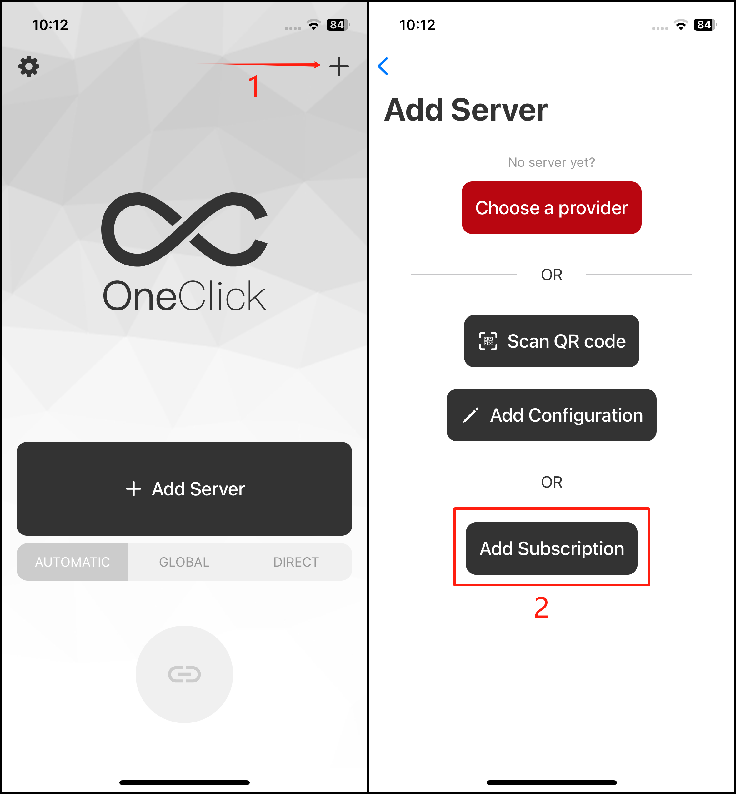
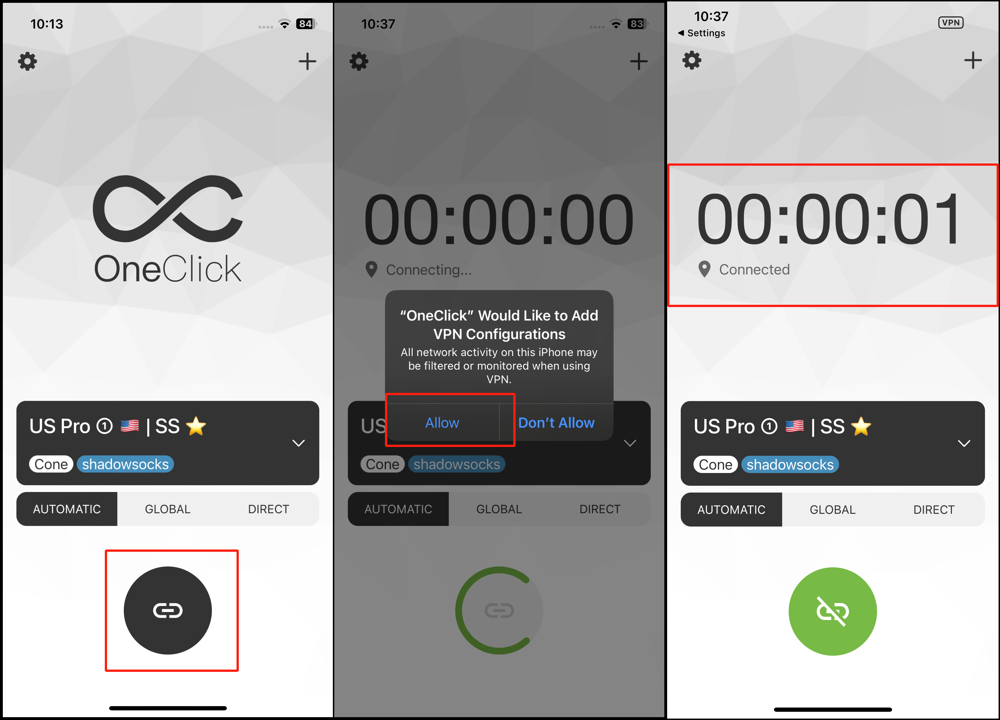

# OneClick for iOS


Please download the OneClick app before proceeding, If you can't, please contact customer care on Telegram [Click here to connect to Customer care Telegram](https://t.me/conesupport)


## Step 1: Download OneClick for iOS

[Click here](https://apps.apple.com/us/app/oneclick-safe-easy-fast/id1545555197) to be redirected to the app page in the iOS App Store.


If you can't find the app, Please refer to [Shadowrocket download guide](recommended-shadowrocket-for-ios/shadowrocket-download-and-install.md) & use our Apple ID



After successfully installing the app, proceed below to setup


***

## Step 2: Import the servers

### Manual Setup

1. Head to your [Dashboard](https://dash.coneapp.top)
2. Scroll to the Quick Import section and tap on Copy

<figure><figcaption></figcaption></figure>

### Paste the api link into the app

1. Open the OneClick app.
2. Click on the "+" icon on the top right corner.
3. Tap on Add Subscription

<figure><figcaption></figcaption></figure>

4. Fill the following fields as shown below, then save✅
   1. Remarks :  Cone
   2. URL : Paste the copied URL

<figure><figcaption></figcaption></figure>

***

## **Step 3: Connect**

1. Select a server from the server list and tap on the 🔗connect icon&#x20;
2. If it is the first time setting up the app, it will ask you to allow the creation of a VPN profile. Click Allow and enter your pin/touch ID/face ID.
3. Your device will be connected.

<figure><figcaption></figcaption></figure>
