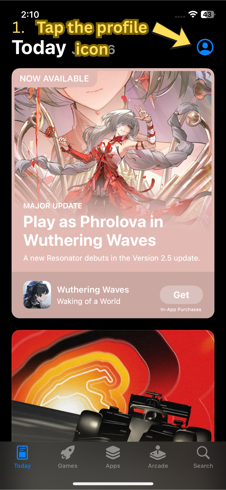

# Shadowrocket Download and Install


If you have trouble setting up, please contact customer care on Telegram. [Click me to connect to Customer care Telegram](https://t.me/conesupport)


## Step 1: Download Shadowrocket for iOS


Shadowrocket is not available on Chinese-mainland apple accounts&#x20;


## **IMPORTANT**


[<kbd>**Click here to get our Apple account**</kbd>](https://app.alekwu.top/soft/shrkios.html)<kbd>**.**</kbd> <kbd></kbd><kbd>You will need this to proceed</kbd>


1. Open the app store and tap the profile️ 🙍‍♂️ icon at the top right.

<figure><figcaption></figcaption></figure>

2. Scroll to the bottom and tap on Sign out, then scroll to the top and sign in using our Apple ID

<figure><figcaption></figcaption></figure>


Notify customer care if it asks for a verification code


<figure><figcaption></figcaption></figure>

<figure><figcaption></figcaption></figure>

3. Once logged in, search for the Shadowrocket app and download it

<figure><figcaption></figcaption></figure>

### **After successful installation,** [**Click here to proceed to Shadwrocket Setup**](shadowrocket-setup.md)


[shadowrocket-setup.md](shadowrocket-setup.md)

