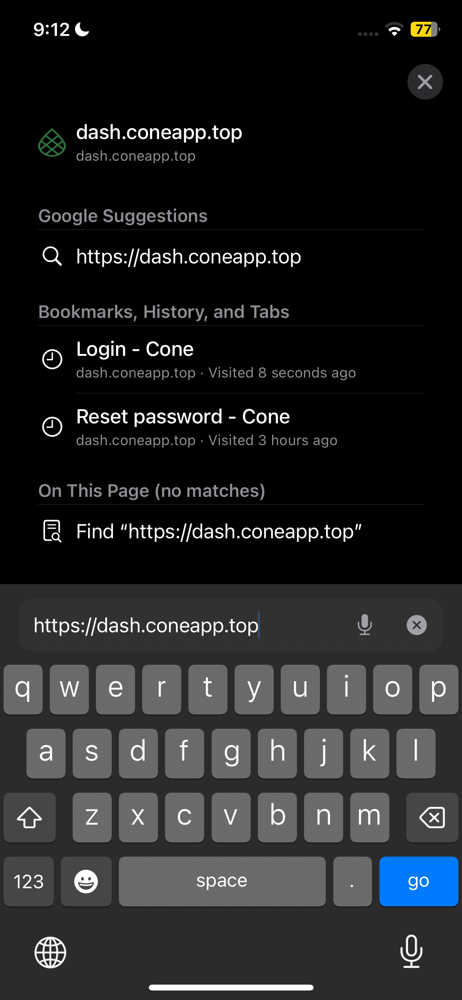
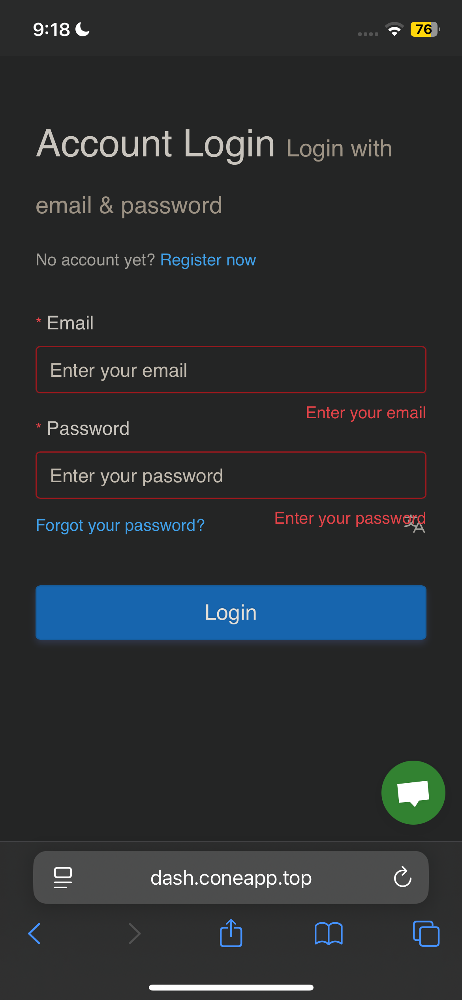

# Shadowrocket Setup

### 📢 READ THIS FIRST

✅ This guide starts **AFTER** you have already installed Shadowrocket.\
❌ If you don’t have the app yet:\
👉 [**Go here to download & install it first**](shadowrocket-install.md)

***



### Step 1: Login to your Cone account

**On your iPhone/iPad, open&#x20;**<mark style="color:purple;">**Safari**</mark>**&#x20;or&#x20;**<mark style="color:yellow;">**Google Chrome**</mark>

<figure><figcaption></figcaption></figure>

**Navigate to this website:** [**https://dash.coneapp.top**](https://dash.coneapp.top/)

<figure><figcaption></figcaption></figure>

**Input your 📧Email & 🔒Password, then&#x20;**<mark style="color:blue;">**Login**</mark>

<figure><figcaption></figcaption></figure>

**Scroll down to Quick Import, tap&#x20;**<mark style="color:blue;">**Shadowrocket Subscribe**</mark>**, then tap on&#x20;**<mark style="color:$success;">**Open**</mark>

<figure><figcaption></figcaption></figure>



### Scroll to **Quick Import** → tap **Shadowrocket Subscribe**





💡 **If One-Click setup doesn’t work** → Use **Manual Setup** below.


***

### 🔹 Method 2: Manual Setup

1. [**Login to your account dashboard**](https://dash.coneapp.top/) **(Sign in with your registered email and password)**
2. Scroll to **Quick Import** and **Copy** the subscription link

3. Add the Link into Shadowrocket
   1. Open **Shadowrocket**
   2. Tap the **+** button (top right)
   3. Change “Type” → **Subscribe**
   4. Paste the copied link in **URL**
   5. Tap **Save** ✅

***

⚠️ **If the API doesn’t work**:

* Make sure Shadowrocket is updated to the **latest version**
* No other VPN/Proxy is running
* You allowed Shadowrocket **network access** in iPhone settings

***

## 🔌 Step 2: Connect

1. In Shadowrocket, select any server from the list
2. Tap the **switch** (top-right) to turn it on
3. First time? → It will ask to create a VPN profile → **Allow** & use Face ID / Touch ID / PIN

✅ You’re now connected — enjoy unrestricted browsing.
