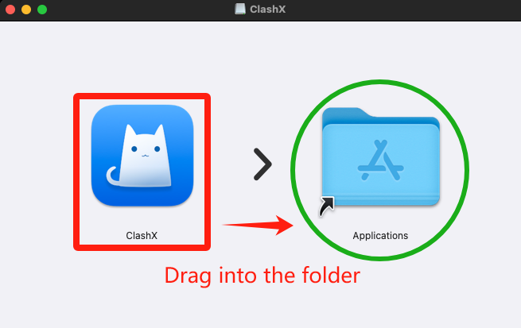

# Clash X for Mac


If you have trouble setting up, Please contact customer care on Telegram [Click me to connect to Customer care Telegram](https://t.me/conesupport)



**The Cone client app is our custom-built client app for Windows / Mac / Android**


***

## Step 1: Download & Install on Mac

Download the Clash app on your Mac computer using the link(s) below;

[**Download Link 1**](https://app.alekwu.top/soft/mac/clashX.dmg)


Alternative download mirrors:

Download on [Github](https://github.com/clashdownload/ClashX/releases/download/1.118.0/ClashX.dmg) (version 1.30.1 and up)


***

## Step 2: Installation


To run the Clash app on your Mac, you'll need to allow third-party apps in your settings.&#x20;

[How to open Mac app from an unidentified developer](https://www.macworld.com/article/672947/how-to-open-a-mac-app-from-an-unidentified-developer.html)


1. Double click the downloaded Clash&#x58;_.dmg_ file

<figure><figcaption></figcaption></figure>

2. Follow the prompt to drag the ClashX app to your Applications Folder

<figure><figcaption></figcaption></figure>

3. After copying, close the window, Open the applications folder and run the ClashX, an app security prompt should show up

<figure><figcaption></figcaption></figure>

4. Head to **System Settings > Privacy & Security,** Click on the _Open Anyways_ option under the secuity notification

<figure><figcaption></figcaption></figure>

## Step 3: Import the servers

1. Head to your [Dashboard](https://dash.coneapp.top)
2. Scroll to the Quick Import section tap on Copy

<figure><figcaption></figcaption></figure>

4. Open the applications folder and run the Clash app

<figure><figcaption></figcaption></figure>

### Paste the API

1. After running ClashX, click the Clash icon (a kitten) on the menu bar, and then click “Config – Remote Config – "Manage" in the menu.

<figure><figcaption></figcaption></figure>

2. There are two fields on the profile page, please fill accordingly;&#x20;
   1. <mark style="color:blue;">URL</mark>: Paste your subscription link
   2. <mark style="color:blue;">Config Name</mark>: Cone

<figure><figcaption></figcaption></figure>

## Step 3: Connect

1. Check "Set as system proxy" to enable ClashX and connect.&#x20;
2. Choose a server from the list
3. Select Proxy Mode : (Global) or Rule

<figure><figcaption></figcaption></figure>

