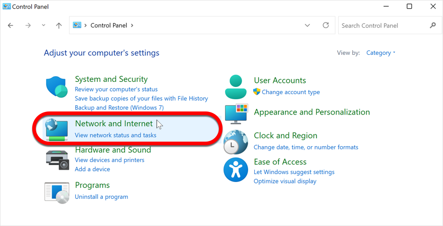

# Windows

### **Step 1: Open the Control Panel**

Click on the Windows **Start** ⊞ menu and type **control panel** in the search bar. Click on the “Control Panel” application that appears.

### **Step 2: Open Network and Sharing Center**

In Control Panel, click on “Network and Internet”and then “Network and Sharing Center”.

<figure><figcaption></figcaption></figure>

<figure><figcaption></figcaption></figure>

### **Step 3: Choose the connection**

In the Network and Sharing Center, choose the internet connection you want to change the DNS settings for. Your active connection is usually named “Wi-Fi” or “Ethernet” and is located on the right-hand side of the window.

<figure><figcaption></figcaption></figure>

### **Step 4: Change adapter settings**

In the new window, you will see general information about your connection. Click on the “Properties” button.

<figure><figcaption></figcaption></figure>

### **Step 5: Choose Internet Protocol Version 4 (TCP/IPv4)**

In the “Properties” window, scroll down to find “Internet Protocol Version 4 (TCP/IPv4)” and click on it to highlight it.

<figure><figcaption></figcaption></figure>

### **Step 6: Click on Properties**

Click on the “Properties” button located below the list of network protocols.

<figure><figcaption></figcaption></figure>

### **Step 7: Choose “Use the following DNS server addresses”**

In the Internet Protocol Version 4 (TCP/IPv4) Properties window, click on the radio button next to “Use the following

<figure><figcaption></figcaption></figure>

### **Step 8: Input the DNS server**

In the “Preferred DNS server” field, enter: **8.8.8.8**

In the “Alternate DNS server” field, enter: **8.8.4.4**


For China, use the following:

In the “Preferred DNS server” field, enter: **114.114.114.114**

In the “Alternate DNS server” field, enter: **8.8.8.8**


<figure><figcaption></figcaption></figure>

### **Step 9: Save the changes**

Click on the “OK” button to save the changes you made to the DNS settings.

<figure><figcaption></figcaption></figure>

### **Step 10: Restart Windows**

Restart your computer for the changes to take immediate effect: click the Windows **Start** ⊞ menu, click the ⏻ power button, and then select **Restart**.


To undo the changes, select the option “Obtain DNS server address automatically” at step 7. This action reverts your settings back to your Internet Provider’s default DNS server.

