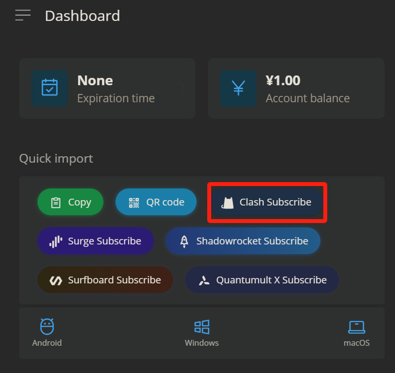

# Clash for Windows


If you have trouble setting up, Please contact customer care on Telegram [Click me to connect to Customer care Telegram](https://t.me/conesupport)


***

## Step 1: Download & Installation

Download and install the Clash app on your system using any of the links below &#x20;

[**Download Link 1**](https://app.alekwu.top/soft/windows/clash_windows.exe)

[**Alternate Download Link**](https://www.mediafire.com/file/l0fddqkdpjbfvrg/clash_windows.exe/file)


If you are using 32-bit Windows, then use the link below


[**Click here to download Clash for WIndows 32-bit**](https://github.com/clashdownload/Clash_for_Windows/releases/download/0.20.39/Clash.for.Windows.Setup.0.20.39.ia32.exe)

***

### Installation

1. Once the download completes, run the installer file to install and follow the installation steps
2. Run the Clash app

<figure><figcaption></figcaption></figure>

***

## Step 3: Server setup


Please choose your preferred setup method based on your needs:

***

* **One-Click Setup**: Quick and easy.
* **Manual Setup**: For more customization and control.


### Option 1 (Recommended): One-Click Setup

1. Head to your [Dashboard](https://dash.coneapp.top)&#x20;
2. Scroll to the Quick Import section and tap on **Clash Subscribe**

<figure><figcaption></figcaption></figure>

4. A new prompt should appear; select the _Open Clash for Windows_

<figure><figcaption></figcaption></figure>


If One-Click setup does not work, please follow the manual setup below


***

### &#x20;Option 2: Manual Setup

1. Head to your [dashboard](https://dash.coneapp.top)
2. Scroll to the Quick Import section and tap on Copy

<figure><figcaption></figcaption></figure>

### Paste the API&#x20;

1. Open Clash by double-clicking on the app icon in the tray on the bottom right corner of your screen (blue cat icon)
2. Go to "Profile" (left-hand menu)
3. Paste the API in the "Download from URL" box and click "Download."

<figure><figcaption></figcaption></figure>

4. Your server list has now been downloaded to the app.

***

## Step 4: Connect

### Select a server and mode

1. Go to "Proxies" (left-hand menu)
2. Select either Global mode or Proxy mode from the top (see box below)
3. Select a server from the list

<figure><figcaption></figcaption></figure>


Modes:

Global: All websites go through Cone

Rule: Websites go to different servers based on pre-configured rule sets.


### Connect

1. Go to the "General" tab
2. Toggle the "System Proxy" switch

<figure><figcaption></figcaption></figure>

You are now connected.


To disconnect: Toggle the "System Proxy" switch again



Make sure to **turn the "System Proxy" switch OFF before quitting the app,** or you won't have any internet if you do so (i.e., a kill switch).

To fix it, restart the app and turn the "System Proxy" switch OFF, and then quit the app.


## Additional Steps \[IMPORTANT]

### Install the TAP engine

If you want to play games with Clash or have all apps go through Clash, you need to install the TAP engine.

1. Go to the "General" tab
2. Click "Manage" next to "TAP Device."
3. Click "Install"

Now reconnect.

### Windows Store apps

Windows Store apps do not go through the VPN by default, even when TAP is enabled. You need to force them by using the UWP Loopback Helper.

1. Go to the "General" tab
2. Click "Launch Helper" next to "UWP Loopback."
3. If there's a popup, click "No."
4. Select all the apps you want to force through the VPN
5. Click "Save Changes."

### Enable Start with Windows

If you want Clash to automatically start when you boot your computer, you need to enable this option.

1. Go to the "General" tab
2. Toggle the "Start with Windows" switch

### Kill all connections when changing server

By default, old connections will not be redirected to the new server but will continue going to the old server until the timeout.

This creates problems when you're switching servers to watch Netflix or if you need a specific IP address as the websites you've just visited will still be going through the old server.

To kill all connections (and therefore forcibly reconnect via the new server), do this:

1. Go to "Settings."
2. Scroll down to "Connections."
3. Select "All" next to "Break when proxy change."
4. Also toggle "Break when Profile change" and "Break when Mode change."

## Troubleshooting

To be done.

### How can I play games with Clash for Windows?

You need to install the TAP Device (see above) and connect to a server that supports UDP.

### Spotify/OneDrive/Other app doesn't work

Windows Store apps don't go through Clash by default. You need to force them to go through by using the UWP Loopback Helper (see [above](broken-reference)).

If it still doesn't work, make sure you've installed the TAP interface (see above).

### Netflix/other website is using another server to connect instead of the one I selected.

mode,ruleruleruleYou have probably selected "rule" mode, and the Netflix website is being redirected to another server based on the Netflix rule set. Select the server you want under "Netflix" in the server list.

***

