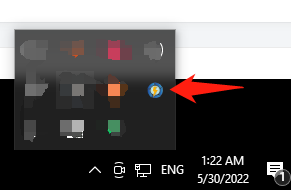
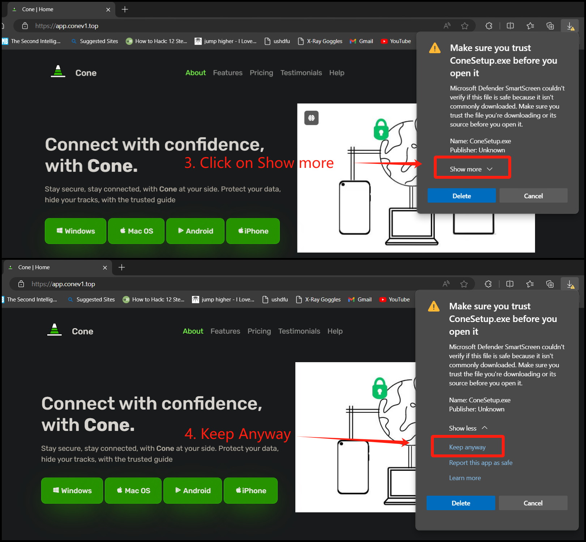

# Netch for Windows


If you have trouble setting up, please contact customer care on Telegram. [Click me to connect to Customer care Telegram](https://t.me/conesupport)



We are using Netch Version 1.92 for this setup. Although the latest version 1.97 is available, we recommend using version 1.92.


***

## Step 1: Download & Installation

Download the Netch app on your Windows computer using the link below.

[**Download Link 1**](https://app.alekwu.top/soft/windows/netchset.exe)

[**Alternate Download Link**](https://www.mediafire.com/file/qzrra01guc3os3t/netchset.exe/file)

***

### Installation

1. Once the download completes, run the Netch installer file to install and follow the installation steps
2. Once the installation completes, run the Netch app from your Desktop or Start menu


**TIP**: Create a desktop shortcut by enabling the option during the installation process


***

## Step 2: Server setup

### &#x20;Option 1: Manual Setup

1. Head to your [dashboard](https://dash.coneapp.top)
2. Scroll to the Quick Import section and tap on Copy

<figure><figcaption></figcaption></figure>

### Paste your API

1. If you can't see the Netch window, double-click on the Netch icon in the tray to open

<figure><figcaption></figcaption></figure>

&#x20;   2\. In the Netch app, click Subscribe > Manage Subscribe Links

.png>)

3\. Paste the API link in the "Link" box. Write "Cone" in the "Remark" box

.png>)

&#x20;    4\. Click Add/Modify&#x20;

&#x20;    5\. Close the window by clicking the X button on the top right

&#x20;    6\. Go to Subscribe > Update Servers (Update Servers from Subscribe Links) to load servers

.png>)

***

## Step 3: Connect

1. Select a server from the _Server_ dropdown.
2. For Mode, select Bypass Lan or Bypass Lan and China."
3. Click Start to connect

.png>)

### Modes

**Global (System Proxy): All apps** that use the system proxy settings are proxied (like web browsers). To use the system proxy, some apps must be configured.

**Global (TUN/TAP):** Through the VPN, all websites and apps are proxied. Games, VoIP, and video conferencing, as well as web browsing, Netflix, and Youtube, etc.

**Global (Non-System Proxy):** On two ports, a SOCKS5 and HTTP server is started, but the system proxy settings are not enabled. OGSpace servers will only be used by programs that you explicitly notify to use the proxy.

**Bypass LAN and China (Non-System Proxy):** On two ports, a SOCKS5 and HTTP server is started, but the system proxy settings are not enabled. OGSpace servers will only be used by programs that you explicitly notify to use the proxy AND THAT ARE NOT CHIINESE WEBSITES OR APPS.

**Bypass LAN and China (System Proxy)—EXCEPT** FOR CHINESE WEBSITES AND APPS, This proxies all apps that use the system proxy settings (like web browsers). Those who want to connect directly to Wechat, Taobao, and other Chinese websites and apps will find this useful.

**Bypass LAN and China (TUN/TAP)—EXCEPT** FOR CHINESE WEBSITES AND APPS, the VPN proxies all websites and apps. Those who want to connect directly to Wechat, Taobao, and other Chinese websites and apps will find this useful.

***

## Troubleshooting

### 1. Download Issues


Downloading the app using Microsoft Edge will sometimes show a prompt to trust the downloaded app.

Follow the instructions below to solve this issue


1. &#x20;After the app is done downloading, it will show the prompt below. Tap on the 3-dot  on the right and click on _Keep_

<figure><figcaption></figcaption></figure>

2. On the next prompt. click on Show more > Keep anyway; this will allow the browser to trust the app

<figure><figcaption></figcaption></figure>

5. Click on Open file to run the installer

### 2. Cannot find Privoxy

This means your antivirus has quarantined/blocked part of the app. Open your antivirus software, navigate to the quarantine/virus chest tab, and restore the privoxy.exe program to it's location.&#x20;

You may want to add an exception to the folder as well so the antivirus doesn't block it again in the future.

You can also re-download the app from our website to restore the entire program. This will require adding the API link back in.

### 3. Problem connecting after upgrading Netch app

Open Netch. Click Options > Remove Netch Firewall Rules.

Also try: Modes > Reload Modes.

### 4. Servers don't connect

If you're using the TUN/TAP mode, try disconnecting and reconnecting. If it still fails, try switching to the System Proxy mode instead.

Make sure you are using the correct API link (APIs differ between Netch versions)

If the issue still persists, check your computer time. For v2ray servers, your computer time must be within 90 seconds of the correct time. If it's not, either sync your time with the internet or adjust it to the correct time in the computer's settings.

### 5. Mode list doesn't show

Instead, you are likely running an old version of Windows or lack some dependencies. If you can't see any modes, we recommend switching to [v2rayN ](broken-reference)instead, as troubleshooting which dependencies are lacking will likely be quite complicated.

### 6. Does not work on Windows 7

Netch needs various dependencies that are native on Windows 10, but which are lacking on Windows 7. We recommend switching to [SSR ](broken-reference)on Windows 7.

If you still want to try using Netch on Windows 7, you can install the update package from Microsoft:

* [Download KB4503292 MSU for Windows 7 32-bit (x86)](http://download.windowsupdate.com/d/msdownload/update/software/secu/2019/06/windows6.1-kb4503292-x86_932f3cccb6343fa2339648b391b80d28f8134870.msu)
* [Download KB4503292 MSU for Windows 7 64-bit (x64)](http://download.windowsupdate.com/d/msdownload/update/software/secu/2019/06/windows6.1-kb4503292-x64_a35bb4ea16d1d529fde9abfe8a0c16e9061f74cd.msu)

### Failed to start Netch/Stuck on connecting

You may need to install lacking dependencies:

* [Visual C++ ](https://support.microsoft.com/en-us/help/2977003/the-latest-supported-visual-c-downloads)
* [.NET Framework 4.8](https://dotnet.microsoft.com/download/dotnet-framework/thank-you/net48-offline-installer)
* [TAP-Windows](https://build.openvpn.net/downloads/releases/tap-windows-9.21.2.exe)
* [Download all dependencies in ZIP format](https://mega.nz/file/9OQ1EazJ#0pjJ3xt57AVLr29vYEEv15GSACtXVQOGlEOPpi_2Ico)

### NAT test failed when using TUN/TAP mode

First, try another server location.

If it keeps failing, you may need to change your STUN server in your Netch settings.&#x20;

Here are a list of available servers (default port: 3478)

* stun.miwifi.com
* stun.bige0.com
* stun.syncthing.net <- Netch Default
* stun.stunprotocol.org
* iphone-stun.strato-iphone.de
* stun.voipstunt.com
* stun.xten.com
* stun.schlund.de
* numb.viagenie.ca
* stun.ekiga.net
* stun.sipgate.net

4 types of NAT:

`NAT1 → Full Cone NAT` Best for gaming

`NAT2:NAT2 → Address-Restricted Cone NAT`

`NAT3 → Port-Restricted Cone NAT`

`NAT4 → Symmetric NAT`Worst
